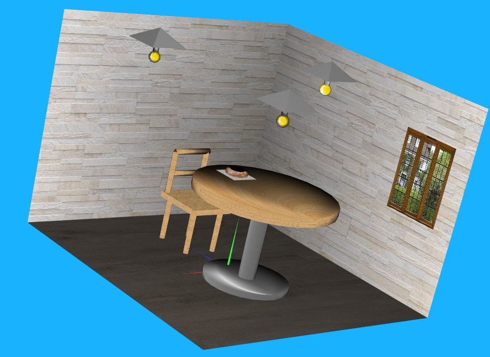

# LAIG 2020/2021

## Group T4xG8y
| Name             | Number    | E-Mail               |
| ---------------- | --------- | -------------------- |
| Fabio Huang      | 201806829 | up201806829@fe.up.pt |
| Nuno Gonçalves   | 201706864 | up201706864@fe.up.pt |

----

## Projects

### [TP1 - Snack Bar](TP1)

- A cena consiste numa parte interior de uma sala de um Snack-Bar, composto por uma cadeira, uma mesa com um guardanapo e um donut em cima, três candeeiros com proteção (forma de piramide) e três paredes, uma delas com uma janela. Todos os objetos da cena têm texturas ou materiais aplicados. 

- Há uma fonte de luz em cada um dos 3 candeeiros, que podem ser ativadas ou desativadas na interface.

- A cena também pode ser escalada para vista mais aproximada ou afastada, e o eixo de coordenadas pode ser ativado e desativado.

- Pode-se alternar entre 3 cameras, no entanto havia erros com a leitura de câmaras do ficheiro xml, por isso foram definidas câmaras no código para serem usadas.

- Scene

   
-----

### [TP2 - ...](TP2)
- (items briefly describing main strong points)

----

### [TP3 - ...](TP3)
- (items briefly describing main strong points)

